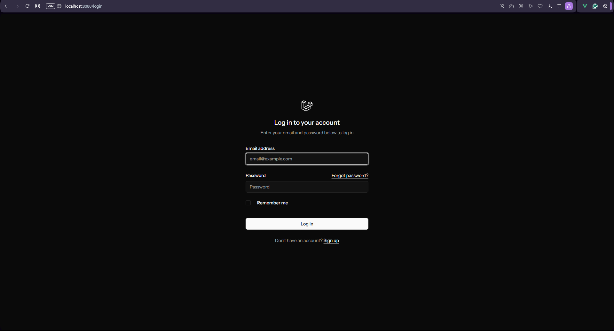

# laravel-filament-test

## Installation

1. Install PHP dependencies using Composer:
```bash
composer install
```

2. Install Node.js dependencies using npm:
```bash
npm install
```

3. Build the assets:
```bash
npm run build
```

4. Start the Laravel Sail environment (Assuming you have Docker):
```bash
./vendor/bin/sail up
```

5. Set up the environment file by copying the example:
```bash
cp .env.example .env
```

6. Run the migrations to set up the database:
```bash
php artisan migrate
```

7. Seed the database with initial data (optional):
```bash
php artisan db:seed
```

8. Login using ``password`` as the password.
    

9. Go to the Dashboard.
    

11. Access Admin Panel at `http://localhost/admin`.
    
